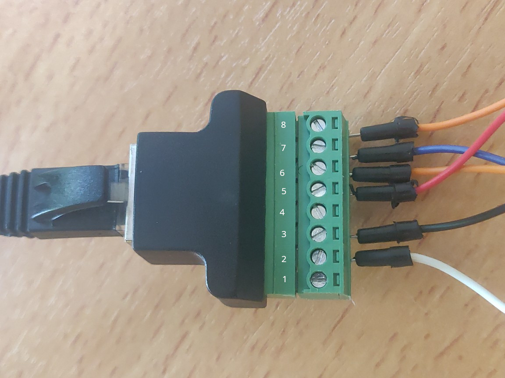
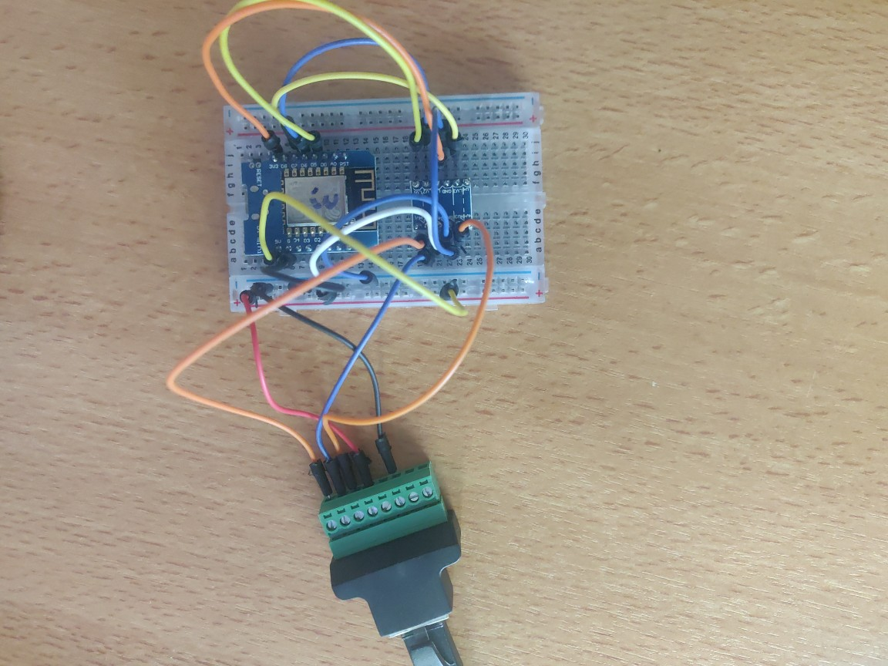

# Standing desk (Fully Jarvis)

## What it does

- Allows you to push any button (except M as of now) on the (programmable memory) handset
- This means you can drive it up and down (a given cm value) or have it go to one of the memory presets
- It CANNOT sense when you push buttons manually

### Possible improvements

Due to my use case (driving it to memory presets), I don't need a few features that could be implemented.

- Drive the desk to a specific height
- Indicator whether the desk is driving

### Disclaimer

It does not add any safety features, so if you break your desk or anything else, because it fails or malfunctions, I take no responsibility whatsoever.
Everything you do is ENTIRELY AT YOUR OWN RISK.

## Why
I bought my standing desk a while ago and have been thinking about integrating it into my home automation system.
It's not really "necessary" but it's a nice touch if you for example want to get your home office setup ready in the morning or track how much time you spend at different heights.

## Prerequisites
1. Fully Jarvis Standing Desk. I bought mine in 2020, but it still seems to be exactly the same in 2022. [Link](https://www.fully.com/standing-desks/jarvis-frame-only.html)
    - I have the programmable memory handset, but I think it should also work with the non-programmable one. It actually might allow you to use the memory functions...
    
    
2. ESP8266. I used a D1 mini, but it should also work with any other ESPHome-capable microcontroller
3. RJ45 Screw Terminal Adaptor Female. [Link](https://www.amazon.com/Poyiccot-Compatible-Terminal-Connector-Ethernet/dp/B07WKKVZRF)
4. RJ45 Ethernet Splitter. [Link](https://www.amazon.com/Ethernet-Splitter-Yeworth-Networking-Extension/dp/B09PMXTX2K)
5. Level shifter. [Link](https://www.sparkfun.com/products/12009)
5. Spare LAN cable (preferably short)
6. Some jumper cables / breadboard / the usual stuff.

## Hardware build

1. Unplug the control panel of the desk and plug the "RJ45 Ethernet Splitter" in between. Then use the spare LAN cable to connect to the "RJ45 Screw Terminal Adaptor"
 

2. I highly suggest that you use a multimeter to verify the pinout and make sure yours is the same as mine! You can just hold down the buttons on the control panel to pull down the voltage on the pins, so it should be easy to verify.
 

3. Wire up the ESP on the breadboard
 

    1. Connect GND and 5V from the desk to the ESPs 5V input and to the high-voltage side of the level shifter (HV & GND).
    2. Connect the 3.3V output from the ESP and GND to the low-voltage side of the level shifter (LV & GND).
    3. Connect ESP pins D5 - D7 to the low-voltage side of the level shifter (LV1 - LV4).
    4. Connect the high-voltage side of the level shifter (HV1 - HV4) to the desk.
    
    Here's a good image from a [tutorial](https://learn.sparkfun.com/tutorials/bi-directional-logic-level-converter-hookup-guide) that shows how to connect the level shifter:
     
    

## Software

### Usage

Download the yaml configuration, and adjust the following to your needs and install it through your regular means:

- The wifi configuration
- The device name
- After trying it out, the milliseconds per centimeter height adjustment factor

### Reverse engineering

I used a cheap logic level analyzer that I hooked up to the screw terminals to see what happens when I push buttons on the handset.
It turns out, the pins are set high (5V) until you press a button, which pulls them low for as long as you press it.
There seem to be three channels through which button press information is relayed to the motor control box.
Different combinations of pulling low the channels indicate different buttons being pressed.
The memory button is a bit different, but not relevant for my use case, so I did not implement it.

### Button combinations

Here is the "protocol" of the desk:

| Desk | ESP |
|------|-----|
| Down | 5   |
| Up   | 6   |
| M1   | 5+6 |
| M2   | 7   |
| M3   | 5+7 |
| M4   | 6+7 |

The M (Memory) button seems to pull down 1 & 8 on the pinout twice.
For my use case, I can just use the memory button directly, so I did not implement anything.

### Pinout RJ45

Here is the pinout of the desk:

| Desk | Usage                    |
|------|--------------------------|
| 1    | Related to memory button |
| 2    | UART TX                  |
| 3    | GND                      |
| 4    | 5V                       |
| 5    | 5V                       |
| 6    | D7                       |
| 7    | D6                       |
| 8    | D5                       |

### Height over UART

The UART bus, where the height of the desk is communicated, has a baud rate of 9600 and sends the height roughly every 200ms.
The data has 9 fields:

| Field | Content    |
|-------|------------|
| 1     | 242        |
| 2     | 242        |
| 3     | 1          |
| 4     | 3          |
| 5     | Multiplier |
| 6     | Height A   |
| 7     | 7          |
| 8     | Height B   |
| 9     | 126        |

Some fields never changed in my testing.

The height can be calculated as: Multiplier * 255 + Height A

Height B seems to be an adjusted height, but the issue is that the multiplier changes in accordance to Height A.
It could possibly be the offset that one can set on the handset.

I chose to calibrate the height with a sensor filter in ESPHome.

## Thanks to

I'm grateful for some other projects, where I could get inspired and check out their C++ code for UART in particular:

- https://github.com/iMicknl/LoctekMotion_IoT/tree/main/packages/esphome
- https://github.com/ssieb/custom_components/tree/master/components/desky
- https://community.home-assistant.io/t/desky-standing-desk-solved-with-esphome/383790/18
- https://embedded-elixir.com/post/2019-01-18-nerves-at-home-desk-controller/
