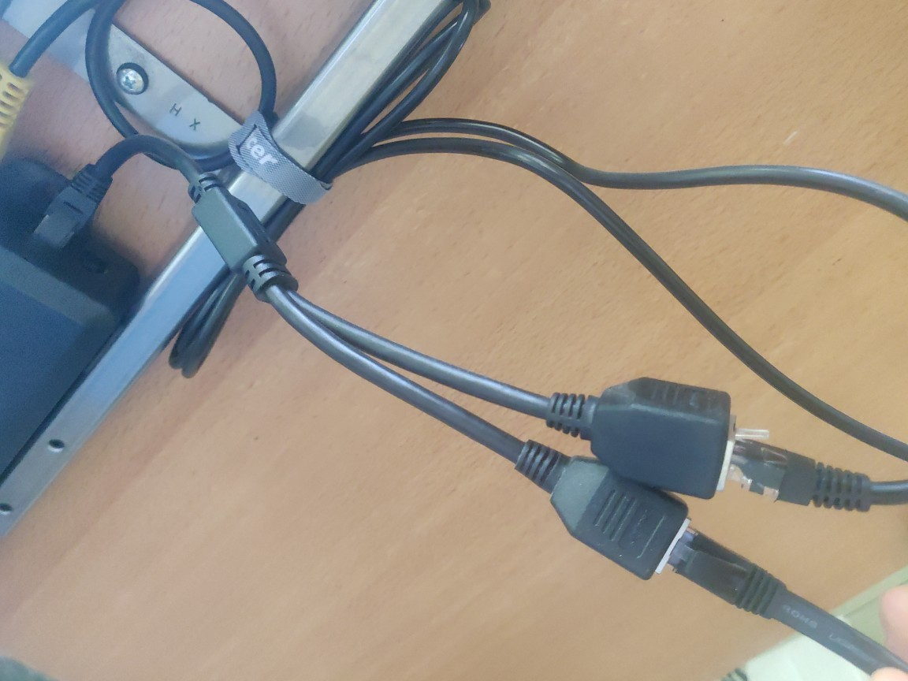

# Standing desk (Fully Jarvis)

## Prerequisites
1. Fully Jarvis Standing Desk. I bought mine in 2020, but it still seems to be exactly the same in 2022. [Link](https://www.fully.com/standing-desks/jarvis-frame-only.html)
2. ESP8266. I used a D1 mini, but it should also work with any other ESPHome-capable microcontroller
3. RJ45 Screw Terminal Adaptor Female. [Link](https://www.amazon.com/Poyiccot-Compatible-Terminal-Connector-Ethernet/dp/B07WKKVZRF)
4. RJ45 Ethernet Splitter. [Link](https://www.amazon.com/Ethernet-Splitter-Yeworth-Networking-Extension/dp/B09PMXTX2K)
5. Level shifter. [Link](https://www.sparkfun.com/products/12009)
5. Spare LAN cable (preferably short)
6. Some jumper cables / breadboard / the usual stuff.

## Hardware build

1. Unplug the control panel of the desk and plug the "RJ45 Ethernet Splitter" in between. Then use the spare LAN cable to connect to the "RJ45 Screw Terminal Adaptor"

2. I highly suggest that you use a multimeter to verify the pinout and make sure yours is the same as mine!
